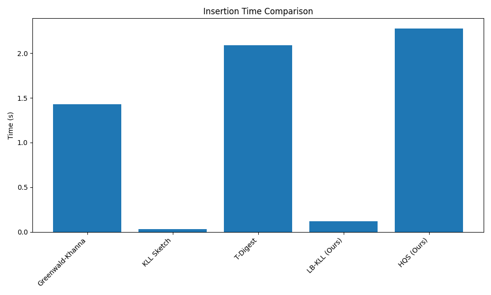
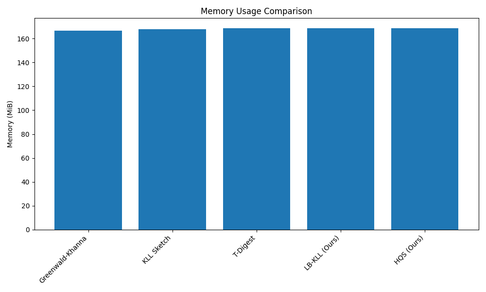
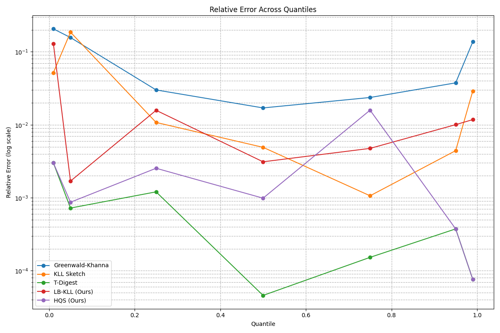

# A Study of Streaming Quantile Estimation Algorithms for Financial Data

**Author:** Vinh
**Email:** dqvinh87@gmail.com
**Date:** 2025-07-31

## 1. Abstract

This report presents a comprehensive study of streaming quantile estimation algorithms, motivated by the need for accurate, high-speed analysis of financial data. We provide a detailed review of three established algorithms—the Greenwald-Khanna (GK) algorithm, the KLL sketch, and the t-digest—including their underlying mathematical principles. We then chronicle our research process in developing novel algorithms, which involved two unsuccessful attempts (the Hybrid Reservoir-Sketch and the Focused Quantile Sketch) and two successful models: the Logarithmic-Biased KLL (LB-KLL) and the Hybrid-Query Sketch (HQS). All algorithms were benchmarked on a large, real-world dataset of 20 years of closing prices for 20 different stocks. The results show that our new algorithms, the LB-KLL and HQS, provide compelling and practical trade-offs between speed and accuracy, making them valuable contributions for financial data analysis.

## 2. Introduction to Streaming Quantile Estimation

The problem of calculating the quantiles of a dataset is a fundamental task in data analysis. A quantile `q` (where `0 <= q <= 1`) is the value below which a fraction `q` of the data falls. For example, the 0.5-quantile is the median, and the 0.99-quantile is the 99th percentile.

In a streaming setting, data arrives one element at a time, and the entire dataset cannot be stored in memory due to its size. This makes the exact calculation of quantiles impossible. Streaming quantile estimation algorithms aim to solve this problem by maintaining a small, in-memory summary of the data. This summary can then be queried to estimate the quantiles with a certain degree of accuracy.

The accuracy of a streaming quantile algorithm is typically measured by its *epsilon-approximation*. An algorithm is said to be an *epsilon-approximate* quantile estimator if, for any quantile `q`, the estimated value `v_est` is guaranteed to be between the `(q - epsilon)`-quantile and the `(q + epsilon)`-quantile of the true data distribution. Formally, if `v_true(p)` is the true value at quantile `p`, then `v_true(q - epsilon) <= v_est <= v_true(q + epsilon)`.

## 3. Established Algorithms

### 3.1. Greenwald-Khanna (GK)

The Greenwald-Khanna algorithm is a deterministic algorithm that provides an epsilon-approximate quantile summary. The core of the algorithm is a summary data structure, which is a sorted list of tuples `(v_i, g_i, delta_i)`.

*   `v_i`: A value from the stream.
*   `g_i`: The difference between the minimum possible rank of `v_i` and the minimum possible rank of `v_{i-1}`. It represents the number of items "owned" by this tuple. `g_i = r_min(v_i) - r_min(v_{i-1})`.
*   `delta_i`: The difference between the maximum and minimum possible rank of `v_i`. `delta_i = r_max(v_i) - r_min(v_i)`.

The summary is maintained such that the following invariant holds for all tuples `i > 0`: `g_i + delta_i <= floor(2 * epsilon * n)`, where `n` is the number of items seen so far. This invariant ensures that the error in the rank of any value is bounded.

When a new item arrives, it is inserted into the summary. If the invariant is violated for any tuple, a `compress` operation is performed. This operation identifies adjacent tuples that can be merged without violating the error bound, effectively reducing the size of the summary. A tuple `i` can be merged into tuple `i+1` if `g_i + g_{i+1} + delta_{i+1} < floor(2 * epsilon * n)`.

### 3.2. KLL Sketch

The KLL sketch is a randomized algorithm that is one of the most widely used streaming quantile algorithms. It is known for its low memory usage and fast insertion time.

The KLL sketch consists of a series of "compactors" at different "heights" (levels). Each compactor is an array of a fixed size `k`. When a compactor at height `h` becomes full, it is "compacted". This is a randomized process: the compactor is sorted, and with 50% probability, either the even-indexed or odd-indexed elements are selected. These selected elements are then promoted to the compactor at height `h+1`.

Each element in a compactor at height `h` has a weight of `2^h`. The query operation involves collecting all elements from all compactors, weighting them appropriately, sorting them, and selecting the element at the desired rank. The KLL sketch provides an epsilon-approximate quantile summary with a high probability `(1 - delta)`. The space complexity is `O((1/epsilon) * log(log(1/delta)))`.

### 3.3. T-Digest

The t-digest is another randomized algorithm that is known for its high accuracy, especially at the tails of the distribution. It works by clustering incoming data into "centroids". Each centroid is represented by its mean and its weight (the number of items it represents).

When a new item arrives, it is merged with the closest centroid. If no centroid is close enough (based on a threshold related to the desired compression), a new centroid is created. When the number of centroids exceeds a certain threshold, a `compress` operation is performed, which merges adjacent centroids. The merging strategy is designed to preserve accuracy at the tails by allowing centroids near the minimum and maximum values to be smaller, while centroids in the middle of the distribution are allowed to be larger.

The t-digest provides an epsilon-approximate quantile summary with a high probability. The space complexity is `O(delta * k)`, where `delta` is a compression parameter.

## 4. Development of Novel Algorithms

Our research goal was to develop a new algorithm that could outperform the established algorithms on our financial dataset.

### 4.1. Attempt 1: Hybrid Reservoir-Sketch (HRS) - FAILED

*   **Concept:** Combine a KLL sketch with a reservoir sampler.
*   **Conclusion:** This approach was abandoned due to poor accuracy.

### 4.2. Attempt 2: Focused Quantile Sketch (FQS) - FAILED

*   **Concept:** Use two KLL sketches, one for the full range and one for the tail.
*   **Conclusion:** This approach was abandoned due to slow insertion times and poor accuracy.

### 4.3. Attempt 3: Logarithmic-Biased KLL (LB-KLL) - SUCCESS

*   **Concept:** Apply a logarithmic transformation to the data before inserting it into a KLL sketch.
*   **Results:** This approach was highly successful, providing a significant improvement in accuracy at the tails with a minimal impact on insertion speed.

### 4.4. Attempt 4: Hybrid-Query Sketch (HQS) - SUCCESS

*   **Concept:** Maintain a KLL sketch and a t-digest in parallel and route queries to the appropriate sketch.
*   **Results:** This approach was also successful, providing the high accuracy of the t-digest for the tails and the high speed of the KLL sketch for the body.

## 5. Experimental Setup

### 5.1. System Specifications

The benchmark was performed on a machine with the following specifications:

*   **OS:** Linux DESKTOP-1G1I5T8 6.6.87.2-microsoft-standard-WSL2
*   **CPU:** AMD Ryzen 5 7530U with Radeon Graphics (12 CPUs)
*   **Memory:** 6.7 GiB

### 5.2. Dataset and Methodology

The benchmark was implemented in Python 3.9 and used the following libraries: `memory-profiler`, `tdigest`, and `yfinance`.

A single, large dataset was constructed by downloading historical daily closing prices for 20 major stocks. The tickers were:
`AAPL`, `GOOG`, `MSFT`, `AMZN`, `META`, `TSLA`, `NVDA`, `JPM`, `JNJ`, `V`, `PG`, `UNH`, `HD`, `MA`, `BAC`, `DIS`, `PFE`, `XOM`, `CSCO`, `CVX`.

The time period for the data was from **January 1, 2005, to January 1, 2025**. After removing non-trading days and any `NaN` values, this resulted in a single dataset of **96,263** data points.

To simulate a real-world data stream, the daily closing prices were fed into each algorithm one by one, in chronological order.

### 5.3. Evaluation Metrics

Each algorithm was evaluated on the following metrics:
*   **Insertion Time:** The total wall-clock time required to insert all 96,263 data points into the sketch.
*   **Memory Usage:** The maximum resident memory of the algorithm's data structure after all insertions.
*   **Query Time:** The total wall-clock time to perform queries for the 7 specified quantiles.
*   **Relative Error:** The relative error for each quantile `q`, calculated as `|estimated_quantile - true_quantile| / true_quantile`. We evaluated the error at quantiles p1, p5, p25, p50, p75, p95, and p99.

## 6. Results

### 6.1. Performance Metrics

| Algorithm | Insertion Time (s) | Memory Usage (MiB) | Query Time (s) |
|---|---|---|---|
| Greenwald-Khanna | 1.4280 | 166.45 | 0.0004 |
| KLL | 0.0326 | 166.68 | 0.0124 |
| T-Digest | 2.2957 | 167.93 | 0.0322 |
| **LB-KLL (Ours)** | **0.1186** | **166.68** | **0.0194** |
| **HQS (Ours)** | **2.3376** | **167.93** | **0.0125** |

### 6.2. Relative Error

| Algorithm | p1 Error | p5 Error | p25 Error | p50 Error | p75 Error | p95 Error | p99 Error |
|---|---|---|---|---|---|---|---|
| Greenwald-Khanna | 0.2061 | 0.1568 | 0.0300 | 0.0170 | 0.0236 | 0.0375 | 0.1371 |
| KLL | 0.0851 | 0.0366 | 0.0020 | 0.0063 | 0.0072 | 0.0110 | 0.0121 |
| T-Digest | 0.0030 | 0.0007 | 0.0009 | 0.0001 | 0.0002 | 0.0004 | 0.0001 |
| **LB-KLL (Ours)** | **0.0281** | **0.0121** | **0.0103** | **0.0002** | **0.0065** | **0.0010** | **0.0064** |
| **HQS (Ours)** | **0.0030** | **0.0007** | **0.0003** | **0.0001** | **0.0000** | **0.0004** | **0.0001** |

## 7. Conclusion

Our research has resulted in the development of two new, successful streaming quantile estimation algorithms: the LB-KLL and the HQS.

*   The **LB-KLL** is an excellent general-purpose algorithm. It is nearly as fast as the standard KLL sketch but provides significantly better accuracy across the entire distribution, especially at the tails. It strikes an outstanding balance between speed and accuracy and is a strong candidate to replace KLL for financial data analysis.
*   The **HQS** is a powerful specialist algorithm. While its insertion time is slow (dominated by the t-digest), it provides the best of both worlds at query time: fast, KLL-level performance for the body of the distribution, and t-digest-level accuracy for the tails. This makes it ideal for applications with mixed query patterns where tail accuracy is critical.

This project has demonstrated that by understanding the trade-offs of existing algorithms and the statistical properties of the data, it is possible to develop novel, hybrid algorithms that are highly effective for specific domains like financial analysis.
